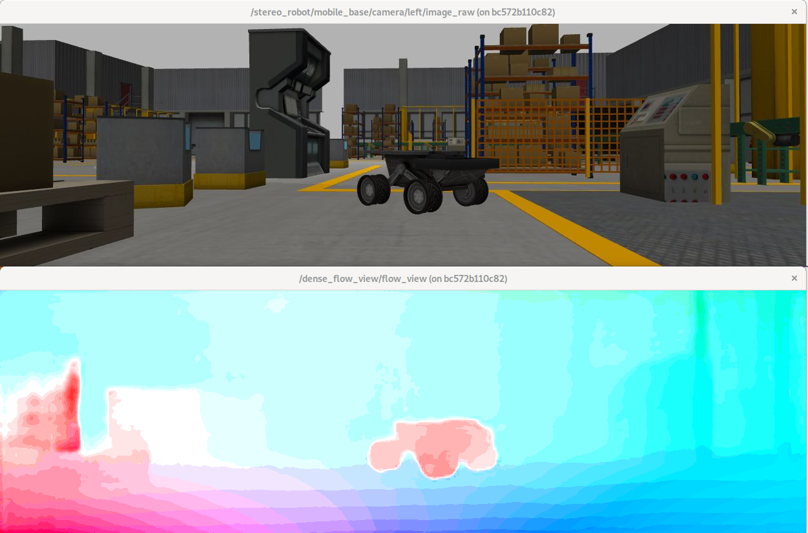

# PWC-Net ROS

ROS package for estimation of optical flow by [PWC-Net](https://github.com/NVlabs/PWC-Net).

This uses [model definition](https://github.com/NVlabs/PWC-Net/blob/master/Caffe/model/pwc_net_test.prototxt) and [trained model](https://github.com/NVlabs/PWC-Net/blob/master/Caffe/model/pwc_net.caffemodel) from [official implementation by Caffe](https://github.com/NVlabs/PWC-Net/tree/master/Caffe).

## Requirements

* Nvidia GPU
* Docker
* [nvidia-container-toolkit and nvidia-docker2](https://github.com/NVIDIA/nvidia-docker)

  nvidia-docker2 is deprecated but it is needed for docker-compose with GPU

## Testing

```shell
$ git clone https://github.com/fujimo-t/pwc_net_ros.git
$ cd pwc_net_ros/docker
$ docker-compose up
```

Then two windows open and you can see input image and visualized optical flow.



## pwc_net_node (Node)

A node estimates dense optical flow from image topic.

### Subscribed topic

* `image` ([sensor_msgs/Image](http://docs.ros.org/api/sensor_msgs/html/msg/Image.html))

  Input image should be remapped. Optical flow is estimated between latest image and it's previous image.

### Published topic

* `optical_flow` ([optical_flow_msgs/DenseOpticalFlow](https://github.com/ActiveIntelligentSystemsLab/optical_flow_msgs/blob/master/msg/DenseOpticalFlow.msg))

  Estimated optical flow.

### Provided services

* `~calculate_dense_optical_flow` ([optical_flow_srvs/CalculateDenseOpticalFlow](https://github.com/ActiveIntelligentSystemsLab/ros_optical_flow/blob/master/optical_flow_srvs/srv/CalculateDenseOpticalFlow.srv))

  Return dense optical flow between input images in request.

### Parameters

* `~image_transport` (string, default: "raw")

  Transport used for the image stream. See [image_transport](http://wiki.ros.org/image_transport).

* `~scale_ratio` (double, default: 1.0)

  For small images, it better set the scale_ratio to be 2.0 or 3.0 so that the input has height/width around 1000.

* `~image_width` (int, default: Not set)
* `~image_height` (int, default: Not set)

  If both of width and height are set, initialize network to use them for input layer's dimmension.
  If not set, the size of first image from topic or service is used for the initialization.

## pwc_net/pwc_net (Nodelet)

Nodelet version of [pwc_net_node](#pwc_net_node-(Node)).
Parameters and topics are same to it.