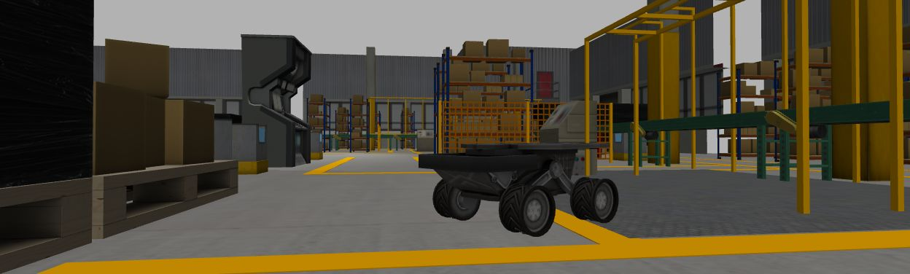

# PWC-Net ROS

ROS package to estimate optical flow by [PWC-Net](https://github.com/NVlabs/PWC-Net).




This uses [model definition](https://github.com/NVlabs/PWC-Net/blob/master/Caffe/model/pwc_net_test.prototxt) and [trained model](https://github.com/NVlabs/PWC-Net/blob/master/Caffe/model/pwc_net.caffemodel) from [official implementation by Caffe](https://github.com/NVlabs/PWC-Net/tree/master/Caffe). The model is [fine-tuned by Sintel, KITTI, and HD1K dataset](https://github.com/NVlabs/PWC-Net/issues/80).

## Requirements

* Nvidia GPU
* Docker
* Docker Compose
* [nvidia-container-toolkit and nvidia-docker2](https://github.com/NVIDIA/nvidia-docker)

  nvidia-docker2 is deprecated but it is needed for Docker Compose with GPU

## Run sample

```shell
$ git clone https://github.com/fujimo-t/pwc_net_ros.git
$ cd pwc_net_ros/docker
$ xhost +local:root # To use GUI, see http://wiki.ros.org/docker/Tutorials/GUI#The_simple_way
$ docker-compose up
```

Then containers is launched:
* ROS master
* rqt
* terminal
  * To run command and ROS nodes

To test pwc_net_ros, execute follow command in the container terminal:

```shell
$ roslaunch pwc_net sample.launch
```

## libpwc_net

Use this library to estimate optical flow.
You can know how to use it by reading source code of `sample_node` 

## sample_node

A node estimates dense optical flow from image topic.

### Subscribed topic

* `image` ([sensor_msgs/Image](http://docs.ros.org/api/sensor_msgs/html/msg/Image.html))

  Input image should be remapped. Optical flow is estimated between latest image and it's previous image.

### Published topic

* `optical_flow` ([sensor_msgs/Image](http://docs.ros.org/api/sensor_msgs/html/msg/Image.html))

  Estimated optical flow.
  `encoding` is `32FC2` (32bit float, 2 channels).
  First channel is optical flow's x-axis component, second is y-axis.

* `visualized_optical_flow` ([sensor_msgs/Image](http://docs.ros.org/api/sensor_msgs/html/msg/Image.html))

  Visualized optical flow as BGR image to see on normal image viewer such as RViz.

### Parameters

* `~image_transport` (string, default: "raw")

  Transport used for the image stream. See [image_transport](http://wiki.ros.org/image_transport).

## License

See [LICENSE](LICENSE).

This repository doesn't directly contain [PWC-Net](https://github.com/NVlabs/PWC-Net) code but used with it.
See [LICENSE.md](https://github.com/NVlabs/PWC-Net/blob/master/LICENSE.md) about PWC-Net's license.

